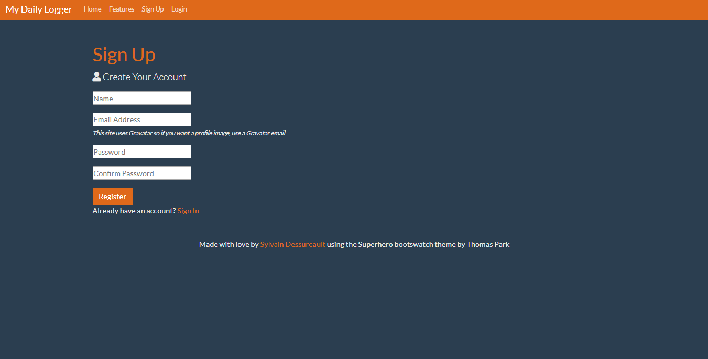
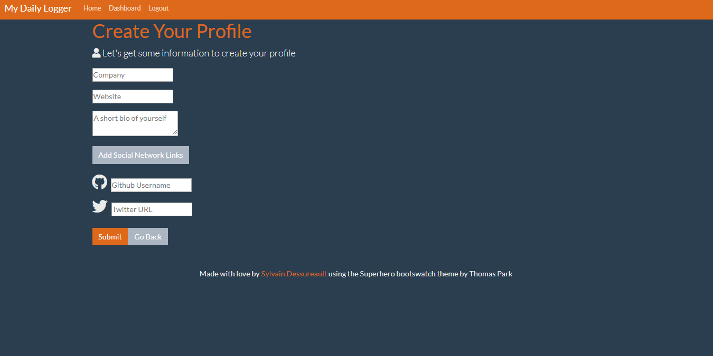
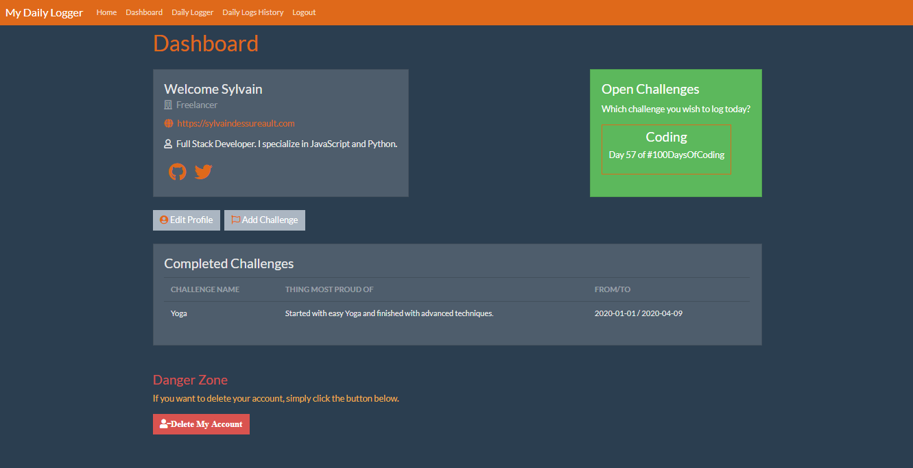
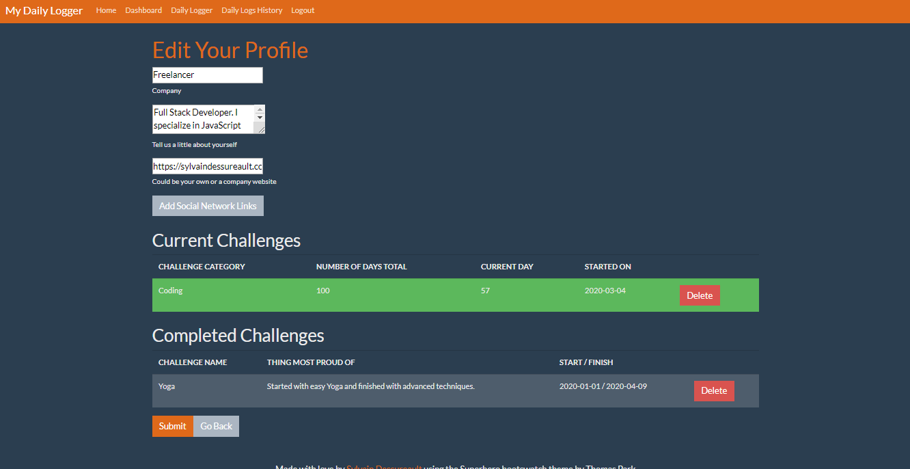
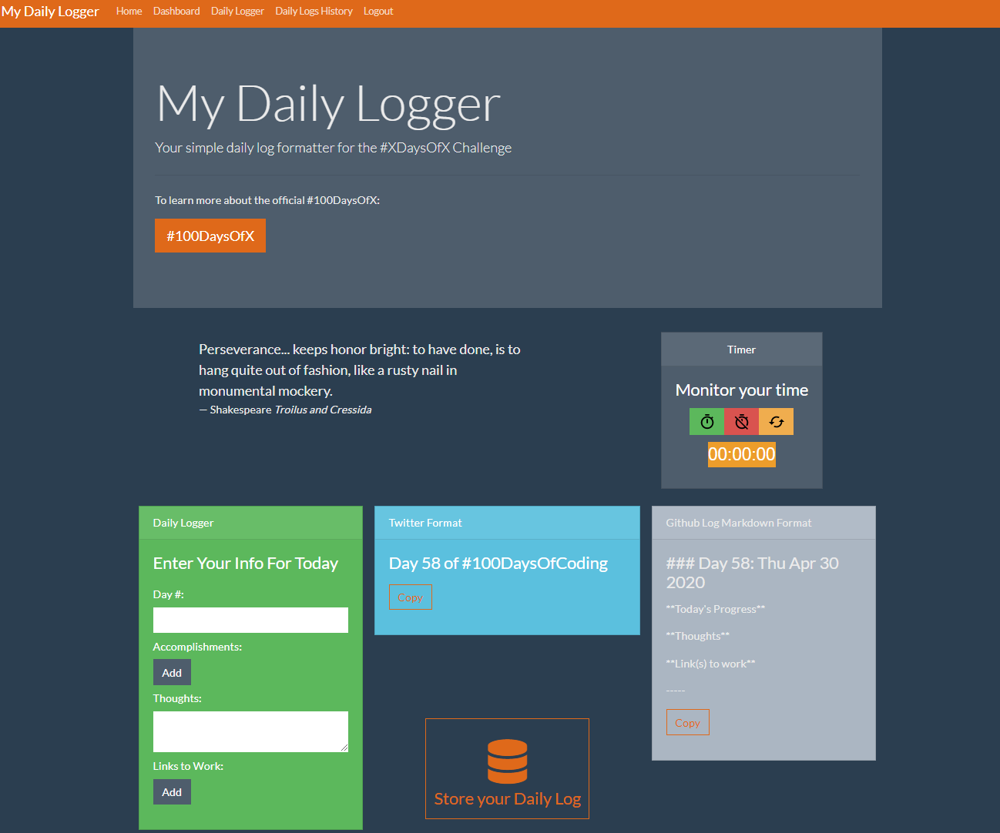
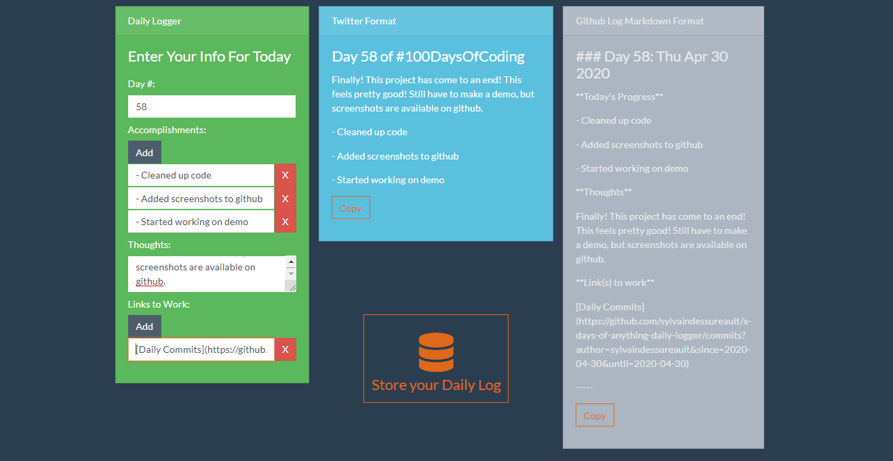

# My Daily Logger

A simple daily log formatter for the #XDaysOfAnything challenge.

## Home Page

## Login / Sign up

If you do not have an account, simply click on signup.

## Main dashboard

This is an example of a dashboard where the user does not have a profile.

### Create a profile

In the dashboard, the user can create a profile with the option to enter social links icons.

The user can also create an open challenge or a completed one.

Here is an example of a dashboard with profile, but no challenges.

Here is an example of a dashboard with profile, with challenges.

### Edit a profile

Still in the dashboard, the user can edit the profile.

## Daily Logger

This is the core purpose of the application, where the user can start a timer, and enter all the daily information as the coding challenge progresses and when finished. On the right side of the page, there are formatting of the information for both Twitter and Github in markdown format. Thus, with the click of a button, we can then just copy-paste and post on the appropriate platform.

### Daily Logging

This is an example of the daily logger in action.

## Daily Log History

The application also stores the daily logs to a database. Hence, the user can track his progress within a single place, and even edit past logs if there was a mistake when logging or simply if there are additions to be made.

## Live Demo

There will shortly be a link here for a live demo of the application.
